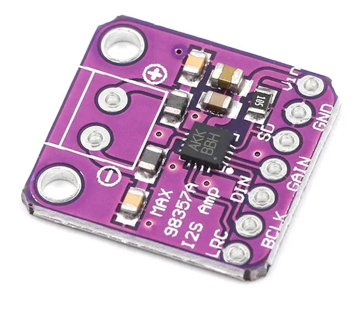
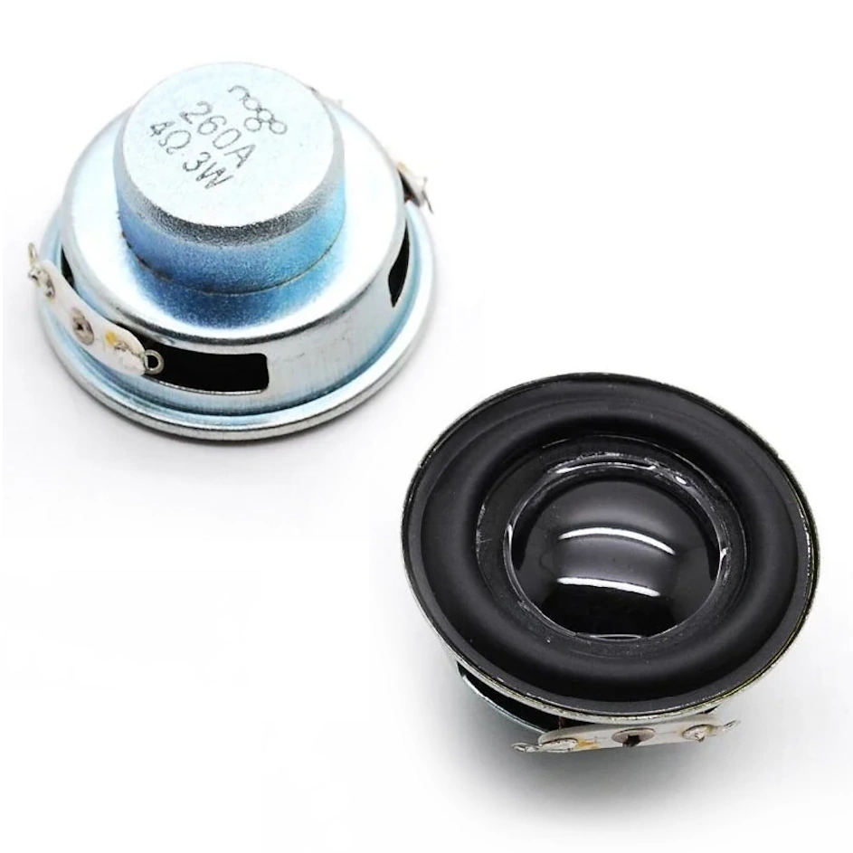
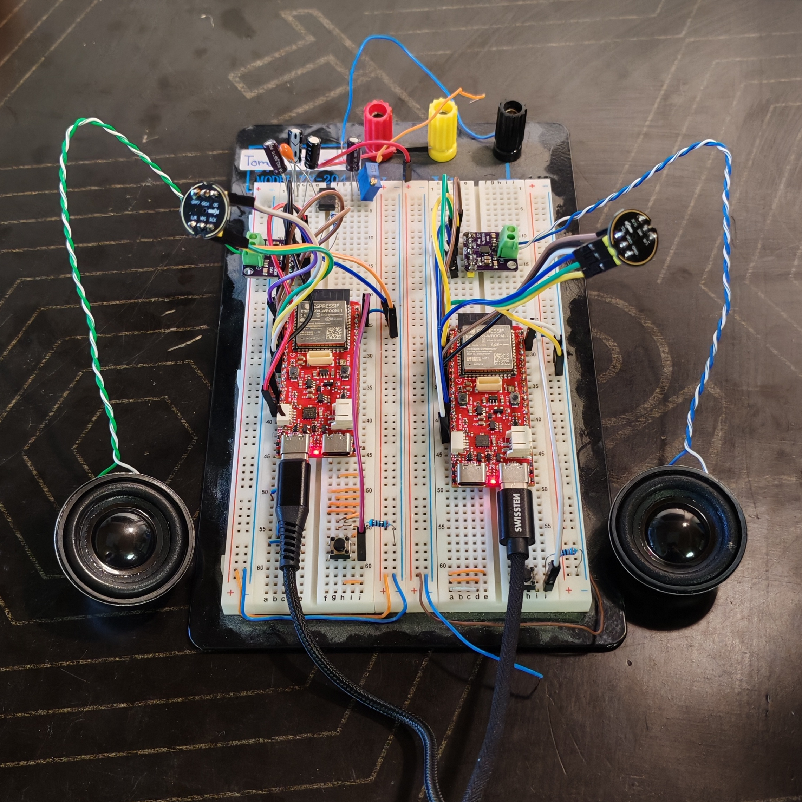

# ESP32-S3-INTERCOM
- Full-Duplex communication device.
- To maximize energy savings, it allows audio transmission only during a specific time interval.

Figure 1. Used [ESP32-S3-DEVKit](https://www.laskakit.cz/laskakit-esp32-s3-devkit/?variantId=13145) (antenna: PCB)

    

Figure 2. Used [I2S microphone](https://www.laskakit.cz/inmp441-modul-i2s-mikrofonu/)‎ ‎ ‎ ‎ ‎ ‎ ‎ ‎ ‎ ‎‎ ‎  ‎ Figure 3. Used [I2S amplifier ](https://www.laskakit.cz/max98357-i2s-mono-zesilovac-3w/)‎ ‎ ‎ ‎‎‎ ‎  ‎‎  ‎ ‎‎ ‎  ‎   Figure 4. Used [3W 4Ω speaker](https://www.laskakit.cz/reproduktor-3w-4-40mm/)

Figure 6. Prototype circuit on a breadboard

Figure 7. Sound testing
