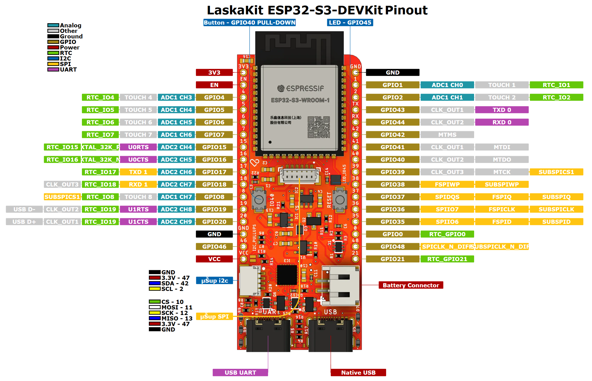
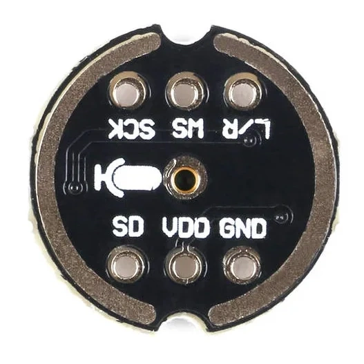
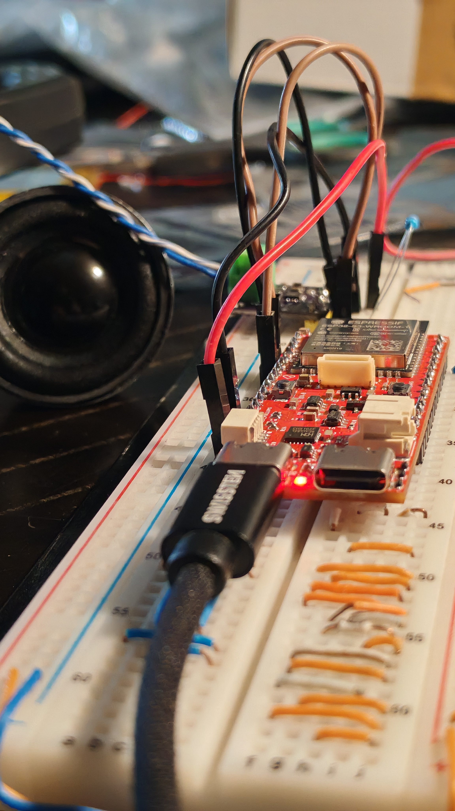

# ESP32-S3-INTERCOM
- Full-Duplex communication device.
- To maximize energy savings, it allows audio transmission only during a specific time interval.

Figure 1. Used [ESP32-S3-DEVKit](https://www.laskakit.cz/laskakit-esp32-s3-devkit/?variantId=13145) (antenna: PCB)

Figure 2. Used [I2S microphone](https://www.laskakit.cz/inmp441-modul-i2s-mikrofonu/)

Figure 3. Used [ESP32-S3-DEVKit](https://www.laskakit.cz/laskakit-esp32-s3-devkit/?variantId=13145) (antenna: PCB)

Figure 4. Used [ESP32-S3-DEVKit](https://www.laskakit.cz/laskakit-esp32-s3-devkit/?variantId=13145) (antenna: PCB)

Figure 5. Sound testing
